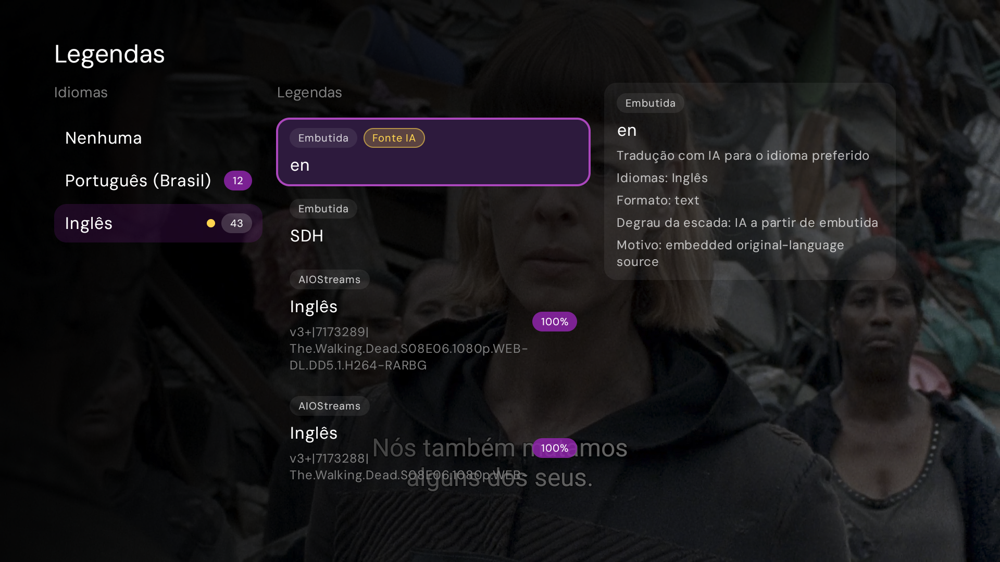
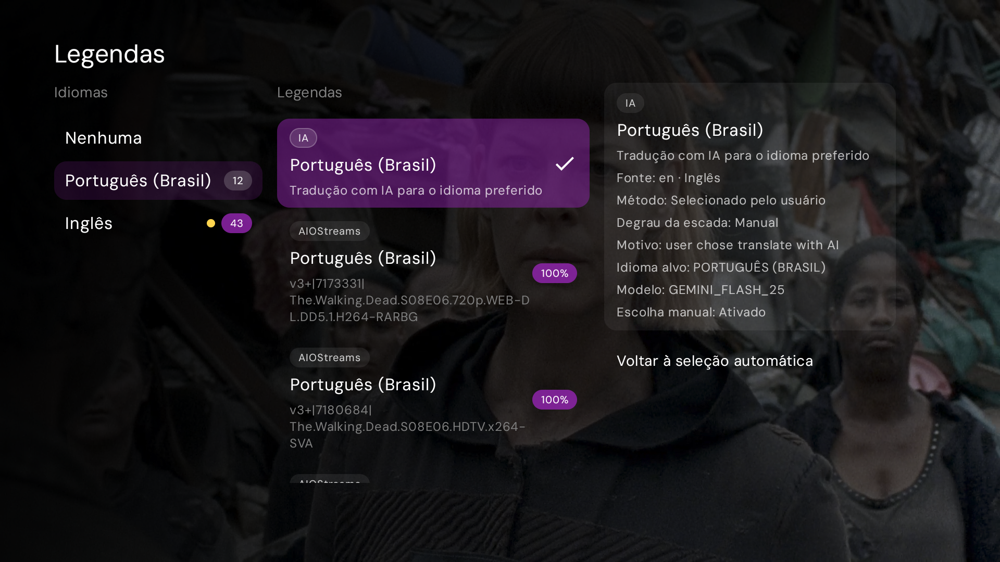
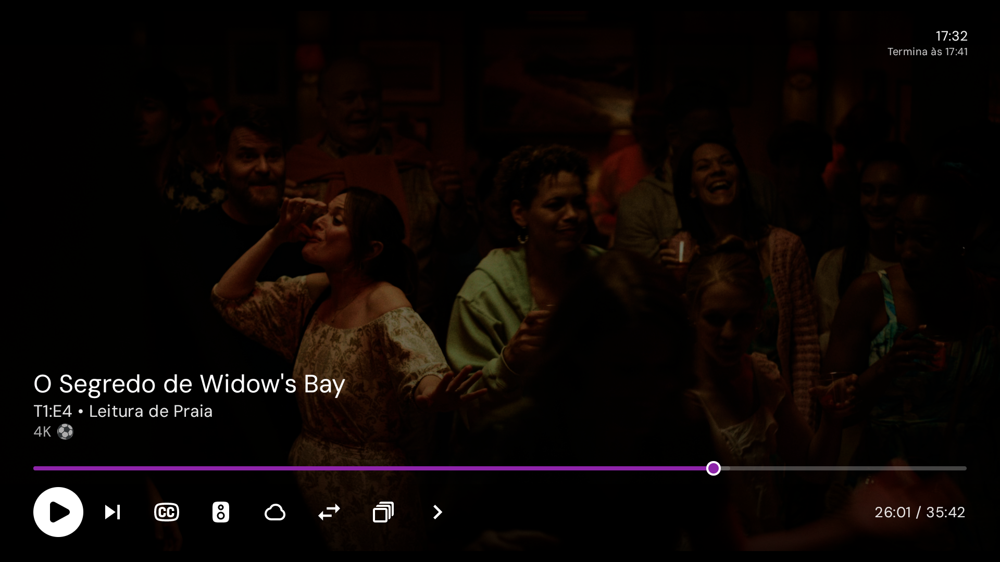

<div align="center">

  

  <p>
    A free, open-source media app for your phone, your desktop, and the TV you already own.
    <br />
    Bring your own sources. Nuvio turns them into a library with artwork, ratings, subtitles, and your place saved on every screen.
  </p>

  <p><strong>Fork build</strong> with smarter AI subtitles and a refined player seek experience.</p>

  [Website](https://nuvio.tv) · [Releases](https://github.com/ceschini86/NuvioTV/releases/latest) · [Upstream](https://github.com/NuvioMedia/NuvioTV)

</div>

## Get this build

- [Latest APK (universal and ABI splits)](https://github.com/ceschini86/NuvioTV/releases/latest)

This package uses the same `applicationId` as official Nuvio (`com.nuvio.tv`) but a different signing key. Uninstall the official app before installing this fork, or Android will refuse the install.

In-app update checks point at **this** repository’s GitHub Releases.

## What’s different in this fork

### AI subtitles — how to use

AI translation works on **ExoPlayer** only. You bring your own API keys; they stay **on this device** (never synced to a Nuvio cloud profile).

1. Open **Playback → AI subtitles**.
2. Enable the providers you want (**Groq**, **Gemini**, **Claude**), paste one or more keys per provider, and use **Test key** if you want a quick validity check.
3. Turn **Smart AI subtitles** on if you want automatic source picking while you watch.
4. During playback, open the subtitle menu (CC). You get three columns: **Languages → Options → Info**.

**Smart (automatic)** picks among **embedded** tracks only:

1. Preferred-language embedded track → use as-is (**no** API call).
2. Else a suitable embedded track (prefer the title’s original language; skip forced / songs-and-signs / bitmap) → **translate with AI**.
3. Else classic auto-select (may pick an addon **without** translating it).

Addon subtitles are **never** auto-translated. Match **%** badges on addons are informational; they do not drive Smart.

**Translate with AI** (on the Info column) locks that exact source so Smart will not override it — useful for an embedded or addon track you chose yourself.

**Reset to smart auto** clears that lock and runs the Smart ladder again (it is not a simple “stop translation”).

While AI is active you will see a yellow cue on the source language and an **AI source** chip on the source option. Turn subtitles off with **None / Off** in Languages.

If every key hits rate limits or fails quality checks, translation turns off but the **current** subtitle selection is kept — the player does not jump to another language.

<p align="center">
  
</p>
<p align="center"><sub>Smart / active AI: yellow language cue, <strong>Fonte IA</strong> chip on the source track, Info shows ladder step and reason.</sub></p>

<p align="center">
  
</p>
<p align="center"><sub>Manual Translate with AI: synthetic <strong>IA</strong> option on the preferred language, diagnostics, and <strong>Voltar à seleção automática</strong>.</sub></p>

### AI subtitles — architecture (short)

```text
Preferred embedded ──► use as-is
        │ (missing)
        ▼
Translatable embedded ──► LLM batches ──► quality gate ──► on-screen cues
        │ (none)
        ▼
Classic auto-select (embedded or addon, no AI)
```

| Piece | Behavior |
|-------|----------|
| **Smart ladder** | Embedded-only; waits for ExoPlayer’s normal text-track scan; no Matroska deep probe for “hidden” tracks |
| **Manual lock** | Translate with AI sets a lock; Reset to smart auto clears it and re-runs the ladder |
| **Providers** | Groq → Gemini → Claude fallback; multiple keys per provider; 429 → cooldown → next key/provider |
| **Quality gate** | Batches that stay in the source language (or fail coverage) are rejected so the next key/provider can retry |
| **Not in scope** | No ASR / Whisper from audio; no AI on **MPV**; no Nuvio-hosted LLM proxy; no on-device ML Kit translation |

Deeper design notes (ladder details, ADRs, file map): [`docs/architecture-ai-subtitles.md`](docs/architecture-ai-subtitles.md). Product scope: [`docs/prd-ai-subtitles.md`](docs/prd-ai-subtitles.md). Subtitle menu behavior: [`docs/prd-ai-subtitles-ui-menu.md`](docs/prd-ai-subtitles-ui-menu.md).

### Player

- Thin **Stremio-style** seek bar: accent played segment, discreet remaining track, solid thumb with a light ring.
- Transport buttons stay solid on focus (no Material “bubble” scale).
- VOD current / duration sits on the same row as the transport controls.

<p align="center">
  
</p>
<p align="center"><sub>Player OSD: thin accent seek bar, solid focus on transport buttons, time on the controls row.</sub></p>

## Build from source

```bash
git clone https://github.com/ceschini86/NuvioTV.git
cd NuvioTV
./gradlew :app:assembleFullDebug
```

Nuvio TV is built with Kotlin, Jetpack Compose, TV Material 3, and Media3. Development requires Android Studio, a JDK, and the Android SDK.

## License

[GNU General Public License v3.0](./LICENSE)
