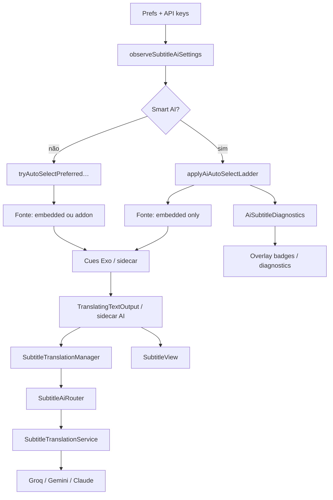

# Arquitetura — Legendas AI (fork NuvioTV)

> **Uso com Agent:** `@` este arquivo para ladder **real**, pipeline, keys, ADRs e mapa de arquivos.  
> **Não usar para:** Must/Should de produto (PRD) nem matrizes completas do overlay (UI menu).  
> **Fonte canônica de:** ordem da ladder (§3), pipeline (§5), ADRs (§10), mapa de arquivos (§9).  
> **Índice:** [`README.md`](./README.md).
>
> Escopo: tradução automática de legendas, smart ladder, scoring, lock manual, diagnósticos e settings.  
> Requisitos de produto: [`prd-ai-subtitles.md`](./prd-ai-subtitles.md).  
> UX do overlay/menu: [`prd-ai-subtitles-ui-menu.md`](./prd-ai-subtitles-ui-menu.md).  
> **Código neste working tree:** branch `fix/ai-ladder-and-rate-limit` (base ship `release/1.0.2`).  
> Paths relativos a `app/src/main/java/com/nuvio/tv/` salvo indicação contrária.

---

## Gaps importantes (ler primeiro)

| Situação | Detalhe |
|----------|---------|
| **Estado do tree** | Feature **presente** neste checkout (`PlayerRuntimeControllerAiSubtitles.kt`, pacote `ui/screens/player/subtitles/`). Branch ativa: `fix/ai-ladder-and-rate-limit`. |
| **Merge `dev`** | `dev` pode ainda não ter a feature até merge — não assumir parity com `dev` remoto sem checar. |
| **[GAP] README vs código** | README do fork deve citar Groq + Gemini + Claude e multi-key / ping (ver PRD §8). Se ainda divergir, trate como bug de docs. |
| **Sync** | API keys ficam em `DeviceLocalPlayerPreferences` (DataStore `device_local_player_prefs`) — **nunca** no blob de perfil. Flags `subtitle_ai_enabled` / `auto_select` / `model` em `PlayerSettingsDataStore` estão em `localOnlyPlayerProfileSettingsKeys` e são **excluídas** do sync de perfil (`ProfileSettingsSyncService.kt`). |

---

## 1. Resumo da feature

### O que o usuário ganha

- Traduzir cues de legenda (ExoPlayer) para o idioma preferido de legenda, com **API key própria** (BYOK).
- **Smart AI subtitles**: o player escolhe automaticamente a melhor fonte **embutida** (preferred sem AI → AI de embedded → fallback clássico). Addons **não** entram na ladder; só via **Translate with AI** (manual).
- No overlay: badges de **match score** (%) (info humana), opção **AI**, long-press → menu **Translate with AI** ou painel de **diagnóstico** da fonte.
- Settings em **Playback → AI subtitles**: enable, smart auto-select, provider preferido, enable por provider, várias keys + **Test key** (ping).

### Fork vs upstream

| | Upstream | Este fork (AI no working tree / `release/1.0.2`) |
|--|----------|------------------------------|
| Seleção clássica por idioma | Sim | Sim (reutilizada / fallback) |
| Sidecar SRT/VTT sem reload | Sim | Sim + hooks AI no render sidecar |
| Tradução LLM / ladder / badges / diagnostics | Não | Sim |
| Restrict engine | — | **ExoPlayer only** |

Contexto mínimo de integração (não é o foco deste doc): tracks embutidas alimentam a ladder Smart; addons (`SubtitleRepository*`) alimentam classic + Translate with AI; SRT/VTT addon costuma ir por **sidecar**; ASS+libass permanece no media-source path; MPV não entra no pipeline AI.

---

## 2. Diagrama do fluxo

```text
┌─────────────────────────────┐
│ PlayerSettings.subtitleStyle│  aiEnabled, aiAutoSelect, aiModel
│ DeviceLocalPlayerPreferences│  credentials JSON + legacy key
└──────────────┬──────────────┘
               │ observeSubtitleAiSettings()
               ▼
┌─────────────────────────────┐
│ ensureSubtitleTranslation   │  SubtitleTranslationManager
│ Manager + SubtitleAiRouter  │
└──────────────┬──────────────┘
               │ playback start / text tracks scanned
               ▼
┌─────────────────────────────┐
│ applySubtitleAutoSelectPolicy│
│  → applyAiAutoSelectLadder  │  (se smart AI)
│  → classic auto-select      │  (senão / fallback)
└──────────────┬──────────────┘
               │ Smart: só embedded; classic: embedded|addon
               ▼
┌─────────────────────────────┐     Exo text renderer
│ Cues (embedded / sidecar)   │──────────────────────┐
└─────────────────────────────┘                      ▼
                                         TranslatingTextOutput
                                         (ou sidecar AI hook)
                                                      │
                         blank text (PGS etc.) ───────┼──► onUntranslatableSource
                                                      │      → next embedded / disable
                         text + cache miss ───────────┼──► Manager.translate()
                                                      │         │
                                                      │         ▼
                                                      │   SubtitleAiRouter
                                                      │   (preferred → outros;
                                                      │    multi-key; 429 cooldown)
                                                      │         │
                                                      │         ▼
                                                      │   SubtitleTranslationService
                                                      │   Groq / Gemini / Claude HTTP
                                                      ▼
                                         Cue traduzido → SubtitleView
                                                      │
               ┌──────────────────────────────────────┘
               ▼
     UI: badge score / “AI” / Translating…
         long-press → Translate with AI (lock)
                   → Diagnostics overlay
```



---

## 3. Smart AI ladder (ordem **real** do código)

Implementação: `ui/screens/player/PlayerRuntimeControllerAiSubtitles.kt`.

Entry point único de auto-seleção: `applySubtitleAutoSelectPolicy()`.

### Pré-condições (`canRunAiAutoSelectLadder`)

Todas verdadeiras:

1. `subtitleAiAutoSelect` (setting “Smart AI subtitles”)
2. `subtitleAiFeatureEnabled` (`aiEnabled`)
3. Credenciais usáveis **ou** legacy key não vazia
4. **Não** está no MPV (`!isUsingMpvEngine()`)

### Cancelamentos / early exits

| Condição | Efeito |
|----------|--------|
| `isUserExplicitSubtitleSelection` | Policy inteira para; ladder não roda |
| `aiSubtitleUserLocked && translation enabled` | Não sobe a ladder; **mantém** a fonte locked (só re-escolhe se seleção zerou). Evita `selectAiTranslationSourceIfAvailable` preferir embedded e roubar addon do Translate with AI. |
| Keep-disabled (`subtitleDisabledByPersistedPreference` / remembered Disabled) | Ladder para; **não** confundir com seleção zerada no switch de stream in-player |
| Troca de stream in-player (`releasePlayer(flush=false)`) | Chama `resetSubtitleAiPolicyForNewMedia()` — zera lock AI, diagnostics, explicit/auto (salvo keep-disabled) e limpa remembered subtitle, para a ladder reavaliar o arquivo novo |
| `useForcedSubtitles` | Só desvia para classic se forced **aplica** (áudio casa com preferido). Senão continua a ladder (evita classic no secundário EN). |
| `preferredLanguage` = none / vazio | Diagnostics `NONE`, AI off |
| Text tracks ainda não escaneadas | Defer (`hasScannedTextTracksOnce == false`) |
| Sem embutida traduzível após scan | `CLASSIC_FALLBACK` imediatamente — **não** espera addons nem pivota por score |

### Ordem dos degraus (`applyAiAutoSelectLadder`)

| # | Rung (`AiSubtitleLadderRung`) | Ação | AI on? |
|---|-------------------------------|------|--------|
| 1 | `PREFERRED_EMBEDDED` | Track **embutida** no idioma preferido (normal, não forced), match via `trackMatchesPreferredLanguage` | **Não** |
| 2 | `AI_EMBEDDED` | `findAiSourceSubtitleTrackIndex` (prefere idioma **original** do conteúdo; senão qualquer texto usável) + `setAiSubtitleTranslationEnabled(true)` | **Sim** |
| 3 | `CLASSIC_FALLBACK` | `tryAutoSelectPreferredSubtitleFromAvailableTracks()` (pode escolher addon **sem** AI) | **Não** |

Enums `AI_SCORED_ADDON` / `PREFERRED_SCORED_ADDON` permanecem no código para labels legadas; a ladder **nunca** os publica.

### Fonte AI embutida (`findAiSourceSubtitleTrackIndex`)

- Pula forced / “songs and signs”
- Pula codecs bitmap: **PGS / DVB / VOBSUB** (`isBitmapCodec`)
- Prefere idioma original do conteúdo; depois tracks com language label; evita SDH/CC no nome quando há alternativa “plain”

### `selectAiTranslationSourceIfAvailable`

| Caso | Comportamento |
|------|----------------|
| `aiSubtitleUserLocked` + addon atual | Mantém o addon (Translate with AI) |
| Auto / toggle / backstop | Só embedded (`selectEmbeddedAiSourceIfAvailable`); **nunca** hunt scored addon |
| Sem fonte | `false` → caller desliga AI / classic |

### Interação com seleção manual

- Escolher track interna ou addon no overlay → `setAiSubtitleTranslationEnabled(false)` + `isUserExplicitSubtitleSelection = true` (`PlayerRuntimeControllerPlaybackEvents` / `TrackSelection`).
- **Translate with AI** (`translateSubtitleWithAi`) → seleciona fonte (embedded **ou** addon), `aiSubtitleUserLocked = true`, AI on, diagnostics `MANUAL`.
- Toggle AI no UI (`OnToggleAiSubtitleTranslation`) → ao **ligar**, também seta `aiSubtitleUserLocked = true`.
- Lock impede: ladder automática e `tryUpgradeAiToPreferredEmbeddedSubtitle` (upgrade de AI → embedded preferido sem tradução).

### Upgrade pós-AI

Se AI está ativa e **não** locked, `refreshAiSubtitleSourceAndMaybeUpgrade` / `tryUpgradeAiToPreferredEmbeddedSubtitle` pode **desligar AI** e trocar para embedded no idioma preferido quando essa track aparecer (ex.: tracks chegaram tarde).

### Fonte intranscritível em runtime

`TranslatingTextOutput` / sidecar: se cues sem texto extraível → `onUntranslatableSource` → `selectAiTranslationSourceIfAvailable(excludeCurrent=true)` (só outra embedded, ou mantém addon se locked); se falhar, desliga AI e, se possível, re-roda a ladder.

---

## 4. Scoring de release (`SubtitleReleaseScoring`)

Arquivo: `ui/screens/player/SubtitleReleaseScoring.kt`.

### Entrada

- **Stream side:** `resolveStreamReleaseNameForSubtitleScore()` = string mais longa entre `streamName`, `contentName`, `title`.
- **Subtitle side:** `subtitleScoreKey(id, url, addonName)` — primeiro de id / filename da URL / addonName (após strip de prefixos `[…]` e AIOStreams `vN+|id|`).

Stream-provided addons (`isStreamProvided`) → score **0**.

### Cálculo

Tokeniza release (separadores `. _ - espaço`), pesos:

| Token | Peso |
|-------|------|
| Palavra de título (default) | 10 |
| Episódio `S01E01` / `1x01` | 8 |
| Release group (após último `-`) | 5 |
| Source (bluray, webrip, …) | 4 |
| Resolução | 3 |
| Codec / áudio | 2 |
| Noise (hdr, proper, idiomas, …) | 1 |
| Números puros | 0 (ignorado) |

`score = matchedWeight * 100 / totalWeight` ∈ \[0, 100\].

`AI_ADDON_SOURCE_MIN_SCORE = 50` permanece no código mas **não** governa a ladder Smart (legado / unused pela policy). Score é **só display** (badge + diagnostics MANUAL).

Cache: `scoreAddonSubtitleCached` no controller (invalida se o nome de release do stream muda).

### Badges na UI

- `SubtitleSelectionOverlay`: `sessionScoreByOptionId` memoizado; `MatchScoreBadge` mostra `"$scorePercent%"` quando `matchScore > 0`.
- Opção AI: badge textual `sub_ai_option_badge` (“AI”).
- Painel de diagnóstico: linha `sub_ai_diagnostics_score` com o score da fonte escolhida (útil em Translate MANUAL de addon).

---

## 5. Pipeline de tradução

### 5.1 Cues → texto → cues

**Embedded / media path (Exo):**

1. Init constrói text renderer com `TranslatingTextOutput(delegate, manager, …)`  
   (`PlayerRuntimeControllerInitialization.kt` — wrapper em torno do `TextOutput` Media3).
2. `onCues(CueGroup)`:
   - AI off → passa cues originais.
   - Extrai texto (`cue.text` joined por `\n`).
   - Blank → `onUntranslatableSource` (PGS etc.).
   - Opcional strip SDH (`[…]`, ♪) se `removeHearingImpaired`.
   - Cache hit → reescreve cues (`applyTranslatedLinesToCues`, marca RTL se necessário).
   - Cache miss → mostra **texto fonte** até a tradução chegar (`kind=waiting`) + `manager.translate(text)` async; reaplica se ainda for o último cue group.

**Lookahead:** `SubtitleOffsetRenderer` / prefetch chama `BufferedCueReader.allCueTexts(renderer, …)` (reflection no buffer interno do text renderer) → `manager.preTranslateWindow` (chunks de 40). Só se `manager.isEnabled`.

**Sidecar addon (SRT/VTT…):** `PlayerSidecarSubtitles.kt`

- Se AI ativa: `applySidecarAiTranslation` + `prefetchSidecarAiWindow` (mesma lógica de cache/in-flight).
- Não força media reload só por causa da AI.

**ASS + libass:** fora do sidecar; AI só age se o path Exo entregar **cues de texto** ao `TextOutput`. ASS renderizado só como bitmap/libass overlay **não** passa por `TranslatingTextOutput` da mesma forma — na prática a feature é pensada para tracks de texto / sidecar.

### 5.2 Manager + Service + Router

| Classe | Path | Papel |
|--------|------|-------|
| `SubtitleTranslationManager` | `…/subtitles/SubtitleTranslationManager.kt` | Fila única live+prefetch, batch ≤40 / janela 150 ms (Groq/Claude) ou ~2 s (Gemini), cache, inFlight, callbacks UI |
| `SubtitleAiRouter` | `…/subtitles/SubtitleAiRouter.kt` | Ordem de providers (preferred primeiro), multi-key, cooldown 429 (~60 s), ping |
| `SubtitleTranslationService` | `…/subtitles/SubtitleTranslationService.kt` | HTTP por provider, parse JSON array, retries Gemini transient, throttle Gemini |
| `SubtitleAiCredentials` | `…/subtitles/SubtitleAiCredentials.kt` | Multi-provider JSON |
| `SubtitleAiModel` | `…/subtitles/SubtitleAiModel.kt` | Enum persistido |

**Batching:** channel ilimitado; junta até 40 linhas na janela do provider (150 ms Groq/Claude, ~2000 ms Gemini); prefetch enfileira na mesma fila (`source=prefetch`); erro → completa com texto original **sem cache** + delay 5 s (retry na próxima renderização).

**Providers / modelos reais (IDs no Service; enum estável no DataStore):**

| Enum | Model ID HTTP | Endpoint |
|------|---------------|----------|
| `GROQ_LLAMA_70B` | `openai/gpt-oss-120b` | `https://api.groq.com/openai/v1/chat/completions` |
| `GEMINI_FLASH_25` | `gemini-3.5-flash-lite` | Generative Language `…:generateContent` |
| `CLAUDE_HAIKU` | `claude-haiku-4-5` | `https://api.anthropic.com/v1/messages` |

Roteamento: providers **enabled + com key**; preferred model primeiro; em falha / 401–403 tenta próxima key; 429 coloca slot em cooldown; `CONTENT_BLOCKED` (Gemini) propaga sem toast “erro genérico” (UI filtra em `onBatchResult`).

**Ping:** `SubtitleAiRouter.ping` / settings `pingSubtitleAiKey` — valida key e captura quota headers quando existirem.

### 5.3 Storage on-device

`data/local/DeviceLocalPlayerPreferences.kt`:

- File: `device_local_player_prefs`
- `subtitle_ai_credentials_json` — lista de providers `{id, enabled, keys[]}`
- `subtitle_ai_api_key` — legacy single-key (migrado para credentials)
- Comentário de classe: **não** amarrado a perfil; **não** sync entre devices

Settings de feature (enable / smart / preferred model string) em `PlayerSettingsDataStore` → `SubtitleStyleSettings.aiEnabled|aiAutoSelect|aiModel`, keys `subtitle_ai_*`, mas **excluídas** do sync de perfil (`localOnlyPlayerProfileSettingsKeys`).

### 5.4 Exo-only / MPV

```kotlin
val canUseAi = !isUsingMpvEngine() && style.aiEnabled && (credentials.anyUsable() || legacyKey.isNotBlank())
```

- `setAiSubtitleTranslationEnabled(true)` no MPV → log *“AI subtitle translation ignored on MPV”* e return.
- UI string: `sub_ai_unavailable_mpv` (“AI translation requires ExoPlayer”).
- Motivo técnico: pipeline depende de `TextOutput` / sidecar Exo + `TranslatingTextOutput`; MPV usa path nativo (`sub-add` / props) sem esse interceptor.

---

## 6. Integração com o player

| Peça | Papel na feature |
|------|------------------|
| `PlayerRuntimeControllerAiSubtitles.kt` | Ladder, lock, diagnostics, wiring do manager, scoring helpers |
| `PlayerRuntimeControllerInitialization.kt` | Instala `TranslatingTextOutput` + prefetch via `BufferedCueReader` |
| `PlayerSidecarSubtitles.kt` | Traduz cues sidecar quando AI ativa |
| `PlayerRuntimeControllerPlaybackEvents.kt` | Events: toggle AI, translate with AI, select track limpa AI |
| `PlayerRuntimeControllerLifecycle.kt` | Reset de flags AI ao trocar stream / release |
| Seleção clássica (`Tracks` / `Observers`) | Fallback; `applySubtitleAutoSelectPolicy` decide ladder vs clássico |

**Reload vs overlay:** AI **não** introduz reload de media source. Usa overlay de cues (embedded TextOutput ou sidecar ticker). Reload de ASS+libass continua regra clássica, independente da AI.

**Lock “Translate with AI”:** `aiSubtitleUserLocked = true` — auto ladder / upgrade preferido não substituem a escolha; diagnostics `userLocked=true`, rung `MANUAL`.

---

## 7. UI e settings

### Settings — Playback → AI subtitles

Arquivos:

- `ui/screens/settings/PlaybackSubtitleSettings.kt` — seção colapsável `sub_ai_section`
- `PlaybackSettingsScreen.kt` / `PlaybackSettingsSections.kt` — host
- `PlaybackSettingsViewModel.kt` — `setSubtitleAi*`, `add/removeSubtitleAiKey`, `pingSubtitleAiKey`

Controles: enable, smart auto-select, cycle preferred provider (Groq → Gemini → Claude), por provider: enable + gerenciar keys + ping.

### Overlay de legendas

`SubtitleSelectionOverlay.kt`:

- Opção sintética `SubtitleAiOptionId = "ai:translate"`
- Badges de score em itens addon
- Long-press em opção AI → diagnostics; em outras → menu translate
- `onTranslateWithAi` → `PlayerEvent.OnTranslateSubtitleWithAi`

### PlayerScreen

- Chip/indicador `isAiSubtitleTranslating` (`sub_ai_translating`)
- `AiSubtitleDiagnosticsOverlayContent` — rung, reason, source, score, target, model, locked
- `SubtitleTranslateMenuOverlayContent` — Translate with AI / disable / stop AI

### Strings âncora (`res/values/strings.xml`)

`sub_ai_*` (enabled, auto_select, model_*, api_key_*, provider_*, ping_*, translating, diagnostics_*, translate_this, unavailable_mpv, option_badge, section, …).  
pt-BR/pt-PT têm parte das strings da feature; cobertura completa varia por locale.

### Estado UI (`PlayerUiState.kt`)

`aiSubtitleAvailable`, `aiSubtitleTranslationActive`, `aiSubtitleDiagnostics`, overlays de menu/diagnóstico, `isAiSubtitleTranslating`, `aiSubtitleLastError`, events `OnToggleAiSubtitleTranslation`, `OnTranslateSubtitleWithAi`, `OnShowAiSubtitleDiagnostics`, …

Enums: `AiSubtitleLadderRung`, `AiSubtitleSourceKind`, data class `AiSubtitleDiagnostics`.

---

## 8. Privacidade, rede e falhas

### O que sai do device

- Texto das linhas de legenda (batches) + idioma alvo → APIs **Groq / Google Gemini / Anthropic**, conforme providers enabled.
- API keys **não** vão para backend Nuvio/Supabase (device-local + exclusão de sync).
- Prefs de enable/model também não entram no sync de perfil (local-only keys).

### Falhas esperadas e fallbacks

| Falha | Comportamento |
|-------|----------------|
| Sem key / feature off | `aiSubtitleAvailable=false`; ladder clássica |
| MPV | AI ignorada |
| 429 / rate limit | Cooldown por key; fallback multi-key. **Esgotadas:** AI off + **preserve selection** (sem classic/FR); `aiSubtitleQuotaExhausted` oculta Translate até cooldown; ver PRD UI §3.5. |
| 401/403 | Próxima key |
| Transient 5xx Gemini | Retry curto (até 2) |
| `CONTENT_BLOCKED` | Sem toast de erro genérico; bisect no service |
| Batch fail genérico | Mostra original sem cache; retry depois; `aiSubtitleLastError` |
| PGS / sem texto | `onUntranslatableSource` → outra fonte ou desliga AI + ladder |
| Score &lt; 50 | Addon não entra como pivot AI (rung 3); score = matching local de release-name |
| Forced subs mode | Só desvia para classic se forced **aplica** (áudio ≈ preferido); senão continua ladder |

### Testes

| Arquivo | O que cobre |
|---------|-------------|
| `SubtitleRoutingTest.kt` | Roteamento HTTP de URI de legenda (não AI LLM) |
| `SubtitleCredentialScopeTest.kt` | Escopo de headers stream→subtitle download (segurança de download, não API AI) |

Não há unit test dedicado só da ladder no tree analisado; a lógica está concentrada em `PlayerRuntimeControllerAiSubtitles.kt` (testável via extração futura).

---

## 9. Mapa de arquivos âncora

| Conceito | Path (working tree / `release/1.0.2`) |
|----------|-------------------------|
| Ladder + lock + diagnostics API | `ui/screens/player/PlayerRuntimeControllerAiSubtitles.kt` |
| Scoring | `ui/screens/player/SubtitleReleaseScoring.kt` |
| Manager / batch / cache | `ui/screens/player/subtitles/SubtitleTranslationManager.kt` |
| HTTP providers | `ui/screens/player/subtitles/SubtitleTranslationService.kt` |
| Multi-key router + ping | `ui/screens/player/subtitles/SubtitleAiRouter.kt` |
| Credentials model | `ui/screens/player/subtitles/SubtitleAiCredentials.kt` |
| Provider enum | `ui/screens/player/subtitles/SubtitleAiModel.kt` |
| Cue interceptor | `ui/screens/player/subtitles/TranslatingTextOutput.kt` |
| Prefetch reflection | `ui/screens/player/subtitles/BufferedCueReader.kt` |
| Sidecar AI hooks | `ui/screens/player/PlayerSidecarSubtitles.kt` |
| Wire TextOutput | `ui/screens/player/PlayerRuntimeControllerInitialization.kt` |
| Events / clear AI on pick | `ui/screens/player/PlayerRuntimeControllerPlaybackEvents.kt` |
| UI state / diagnostics model | `ui/screens/player/PlayerUiState.kt` |
| Overlay badges / menus | `ui/screens/player/SubtitleSelectionOverlay.kt` |
| Diagnostics compose | `ui/screens/player/PlayerScreen.kt` (`AiSubtitleDiagnosticsOverlayContent`, …) |
| Settings UI | `ui/screens/settings/PlaybackSubtitleSettings.kt` |
| Settings VM | `ui/screens/settings/PlaybackSettingsViewModel.kt` |
| Feature flags (profile DS, local-only sync) | `data/local/PlayerSettingsDataStore.kt` (`SubtitleStyleSettings.ai*`) |
| API keys device-local | `data/local/DeviceLocalPlayerPreferences.kt` |
| Sync exclusions | `core/sync/ProfileSettingsSyncService.kt` (`localOnlyPlayerProfileSettingsKeys`) |
| README claims | `README.md` (seção AI subtitles) |
| Strings | `app/src/main/res/values/strings.xml` (`sub_ai_*`) |

---

## 10. ADRs curtos

### ADR-AI-1 — BYOK on-device

- **Contexto:** Sem backend Nuvio para LLM.  
- **Decisão:** Keys em `DeviceLocalPlayerPreferences`; feature toggles locais (excluídos do sync de perfil).  
- **Consequência:** Usuário paga/quota própria; keys não viajam entre TVs via conta; texto de legenda vai ao provider terceiro.

### ADR-AI-2 — ExoPlayer only

- **Contexto:** Interceptor natural é `TextOutput` Media3 + sidecar Compose/Exo.  
- **Decisão:** Gate `!isUsingMpvEngine()` em availability, enable e ladder.  
- **Consequência:** Anime/AUTO→MPV não traduz; UX deve comunicar (`sub_ai_unavailable_mpv`).

### ADR-AI-3 — Ladder antes de traduzir qualquer coisa

- **Contexto:** Traduzir addon automático desperdiça quota, acopla a timing de addons e piora sync.  
- **Decisão:** Smart AI = só embutidas (preferred sem AI → AI embedded → classic). Addon só via **Translate with AI** (lock MANUAL).  
- **Consequência:** Ladder mais curta; sem defer por loading de addons; score deixa de ser gate da policy.

### ADR-AI-4 — Lock manual supera auto

- **Contexto:** Auto-select agressivo irrita após escolha explícita.  
- **Decisão:** `aiSubtitleUserLocked` + `isUserExplicitSubtitleSelection`; pick normal desliga AI.  
- **Consequência:** Dois locks relacionados (explícito vs AI); translate menu e toggle AI setam lock AI.

### ADR-AI-5 — Limiar de score 50 (**superseded**)

- **Contexto (histórico):** Addon “errado” como pivot de tradução gerava lixo.  
- **Decisão antiga:** `AI_ADDON_SOURCE_MIN_SCORE = 50` para rung AI addon.  
- **Superseded:** Smart não pivota em addon; constante pode permanecer no código sem uso na ladder. Score = badge / diagnostics only.

### ADR-AI-6 — Multi-provider + multi-key

- **Contexto:** Rate limits e keys inválidas.  
- **Decisão:** `SubtitleAiRouter` com preferred, fallback de providers/keys, ping, cooldown 429.  
- **Consequência:** Enum de model ids estáveis no DataStore apesar de IDs HTTP mudarem (Groq/Gemini renomeados nos comentários).  
- **Gemini:** cota RPM/TPM/RPD é **por projeto AI Studio**, não por key — multi-key só ajuda com projetos distintos.

### ADR-AI-7 — Falha sem cache permanente do original

- **Contexto:** Cachear inglês após erro “gruda” tradução errada.  
- **Decisão:** Em erro de batch, completa deferred com original **sem** `cache[]`; retry na próxima cue.  
- **Consequência:** Pode mostrar fonte de novo no wait (`waiting`); melhor que stuck wrong language.

### ADR-AI-8 — Runtime backstop para bitmap

- **Contexto:** Metadata de codec mente; PGS selecionado como “AI source”.  
- **Decisão:** `onUntranslatableSource` quando `extractRawText` blank; próxima fonte = outra **embedded** (ou mantém addon se MANUAL locked); sem hunt scored addon.  
- **Consequência:** Se nenhuma embedded, desliga AI (+ classic se smart).

---

## Cheat sheet — respostas do critério de pronto

1. **Ordem real da ladder?** §3 — `applyAiAutoSelectLadder`: preferred embedded → AI embedded → classic.  
2. **API key / roteamento?** §5.2–5.3 — `DeviceLocalPlayerPreferences` JSON; `SubtitleAiRouter` preferred + fallback Groq/Gemini/Claude (`SubtitleTranslationService` IDs reais).  
3. **Cue embutido → tela?** §5.1 — Exo `TextOutput` → `TranslatingTextOutput` → manager/router/service → cues com texto traduzido no `SubtitleView`.  
4. **Lock manual impede?** §3 / §6 — ladder automática e upgrade para embedded preferido; diagnostics marca `userLocked`.  
5. **Por que não no MPV?** §5.4 — gate explícito; sem `TranslatingTextOutput` no path MPV.

---

*Pacote AI versionado via exceções em `.gitignore` (`docs/README.md` + estes três docs). Outros arquivos sob `docs/` continuam locais.*
